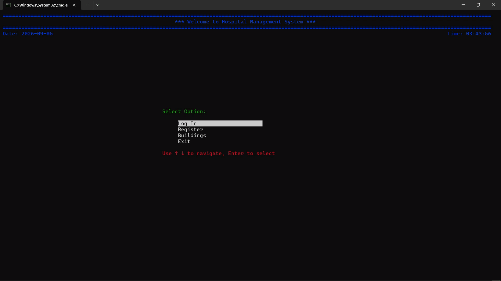

# 🏥 Hospital Management System (CLI)

A robust, stateful Command-Line Interface (CLI) application built in Python. This project demonstrates advanced Object-Oriented Programming (OOP) principles, complex UI rendering using the `curses` library, and secure local data serialization.

 <!-- Ensure your demo.gif is in the same folder -->

## ✨ Features
* **Role-Based Access Control:** Secure, separate event loops and interfaces for Administrators, Doctors, Nurses, and Patients.
* **Stateful Terminal UI:** Built entirely with Python's `curses` library for seamless menu navigation, user input handling (with custom backspace/validation logic), and dynamic data table rendering.
* **Data Serialization:** Implements Python's native `pickle` library to efficiently save and load complex, circular in-memory object relationships (like Doctors assigned to Patients) across application sessions.
* **Modular OOP Architecture:** Clean separation of concerns with encapsulated `Person` subclasses (Patient, Doctor, Nurse) and `Building` interfaces (Ward, Pharmacy, Department).

## 🚀 Installation & Setup

1. **Clone the repository:**
   ```bash
   git clone https://github.com/Galal012/Hospital-Management-System.git
   cd hospital-management-system
   ```

2. **Install dependencies:**
   *(Note: The `curses` library comes pre-installed with Python on Mac/Linux. Windows users need the `windows-curses` package, which is included in the requirements).*
   ```bash
   pip install -r requirements.txt
   ```

3. **Run the Application:**
   ```bash
   python main.py
   ```
   *(Note: You can easily populate the system with dummy data by running `python generate_test_data.py` before starting the main application).*

## 🧠 System Architecture

This project was intentionally designed to focus on the **Single Responsibility Principle** and **Event-Driven Architecture**:
* **`main.py`:** Handles the master event loop and routes user input to the correct interface sub-loops without relying on deep, memory-consuming recursion.
* **`people.py` & `buildings.py`:** Pure data models utilizing inheritance and encapsulation to represent system entities. They do not know about the UI or the database.
* **`helper_classes.py`:** A dedicated UI engine that handles all `curses` screen drawing, window management, and terminal-resize error handling.
* **`data_manager.py`:** Handles all binary serialization to maintain state persistently when the application closes.